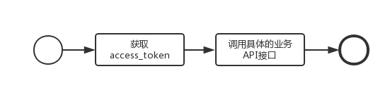
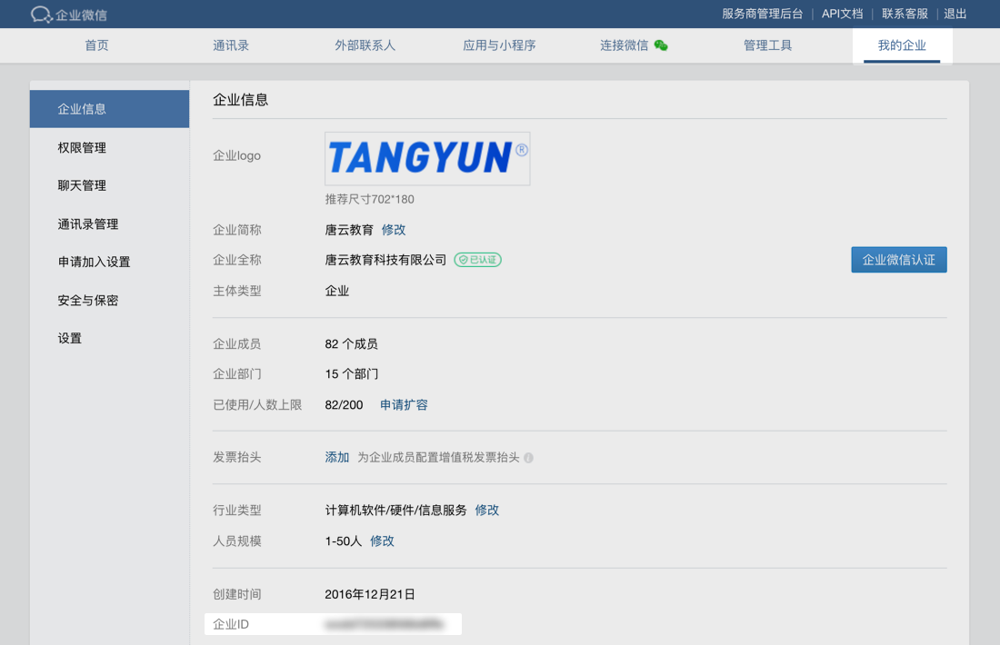
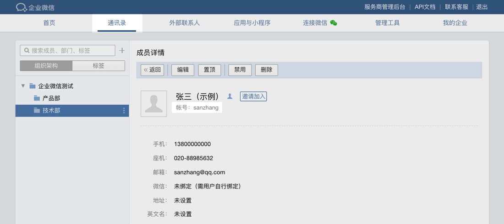
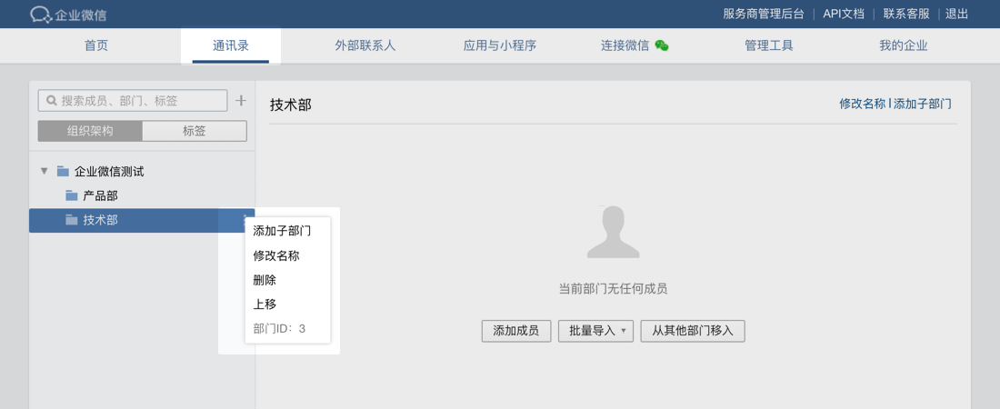
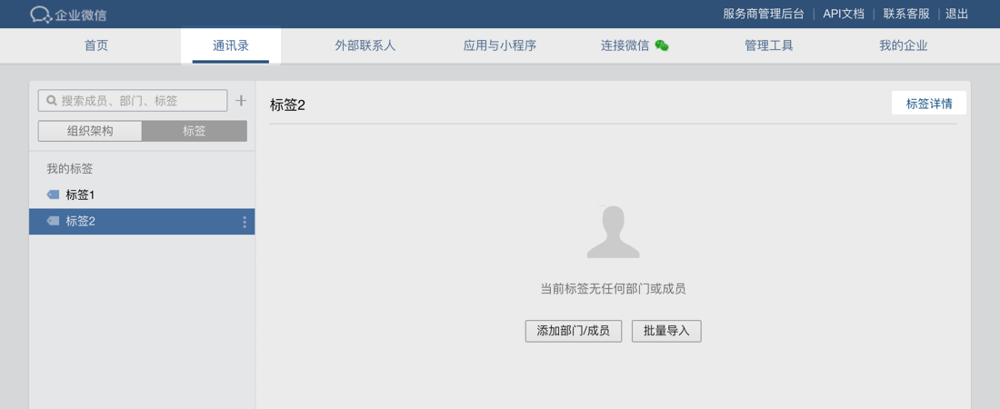
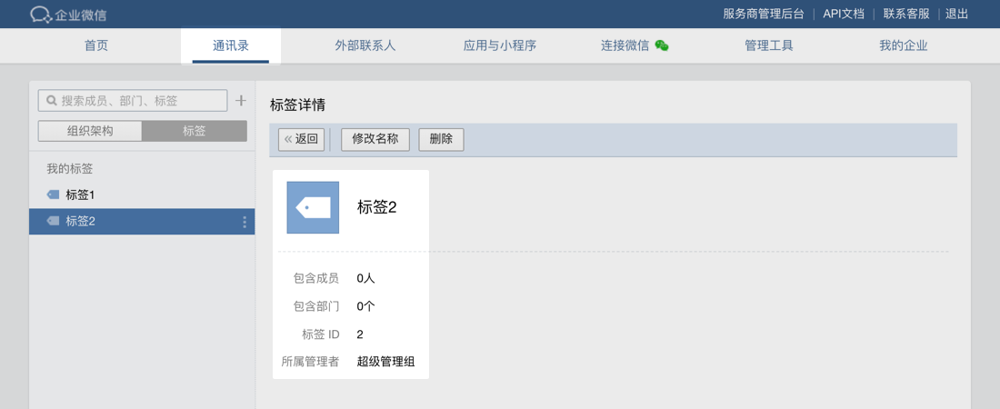
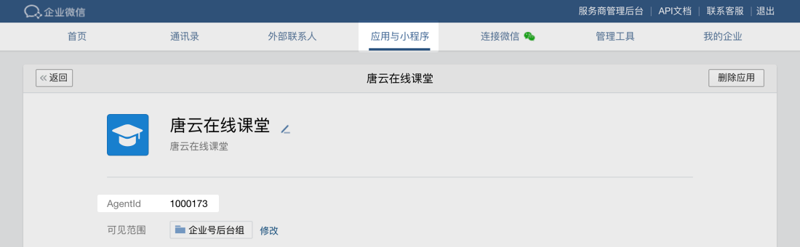
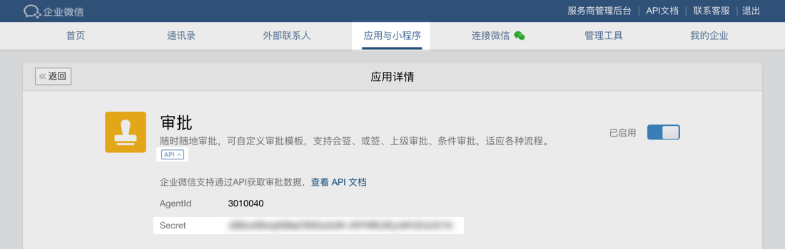
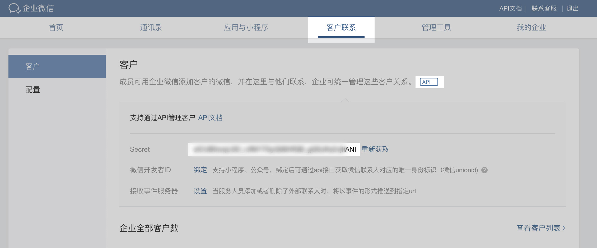

# 企业微信消息发送

## 开发前必读

### 开发文档阅读说明

- 1、服务端API开放了丰富的能力接口，开发者可以借助接口能力，实现企业服务及企业微信的集成。支持的能力，通过目录导航可以快速预览，目录树按功能块聚合归类，如通讯录管理、消息推送等。

- 2、文档的阅读次序，建议先阅读一遍开发指南，以及接口access_token获取。然后就可以独立查看各个功能块文档说明。

- 3、所有的接口需使用HTTPS协议、JSON数据格式、UTF8编码。接口说明格式如下：

  ```bash
  请求方式：GET/POST（HTTPS）
  请求地址：https://qyapi.weixin.qq.com/cgi-bin/gettoken?corpid=ID&corpsecret=SECRET
  请求包体：
  ...
  参数说明：
  ...
  权限说明：
  ...
  返回结果：
  ...
  参数说明：
  ...
  ```

    - 1、**请求方式**，标明接口调用的HTTP方法，区分HttpGet/HttpPost请求。所有的请求都为https协议。

    - 2、**请求地址**，参数中标注 **大写的单词** ，表示为需要 **替换的变量**。在上面的例子中 ID 及 `SECRET` 为需要替换的变量，根据实际获取值更新。假如，这里我们获取到的 `ID=wwabcddzxdkrsdv` ，`SECRET=vQT_03RDVA3uE6JDASDASDAiXUvccqV8mDgLdLI` ，那么上述的请求在发送时为：

      ```bash
      https://qyapi.weixin.qq.com/cgi-bin/gettoken?corpid=wwabcddzxdkrsdv&corpsecret=vQT_03RDVA3uE6JDASDASDAiXUvccqV8mDgLdLI
      ```

    - 3、**请求包体/参数说明**，标明请求参数示例及说明，参数说明包括字段含义、取值范围，开发者在设计数据结构时，应参考该定义范围。

    - 4、**权限说明**，标明接口的使用范围，开发者应特别**留意调用场景**。比如，同步通讯录的接口必须要用通讯录同步助手的access_token，发送消息指定的范围必须是应用可见范围内的结点等。

    - 5、**返回结果/参数说明**，标明返回参数示例及说明。特别留意，所有接口在调用失败时返回包里都有errcode、errmsg（部分接口在调用成功时没有返回errcode和errmsg）。开发者需**根据errcode存在且不为0判断为失败，否则为成功**（errcode意义请见[全局错误码](https://work.weixin.qq.com/api/doc/90000/90135/90664#10649) (https://work.weixin.qq.com/api/doc/90000/90135/90664#10649)）。而errmsg仅作参考，后续可能会有变动，因此不可作为是否调用成功的判据。

### 接口调用流程



- 1、获取access_token，参考 [文档说明](https://work.weixin.qq.com/api/doc/90000/90135/90664#15074) (https://work.weixin.qq.com/api/doc/90000/90135/90664#15074)。
- 2、缓存和刷新access_token。
  开发者需要缓存access_token，用于后续接口的调用（注意：不能频繁调用gettoken接口，否则会受到频率拦截）。当access_token失效或过期时，需要重新获取。
- 3、调用具体的业务接口。

### 调用频率限制

出于系统保护的考虑，我们对接口的调用做了频率限制。参考说明：附录 - [主动调用频率限制](https://work.weixin.qq.com/api/doc/90000/90135/90664#10785) (https://work.weixin.qq.com/api/doc/90000/90135/90664#10785)

## 基本概念介绍

### 术语介绍

#### corpid

每个企业都拥有唯一的corpid，获取此信息可在管理后台“我的企业”－“企业信息”下查看“企业ID”（需要有管理员权限）



#### userid

每个成员都有唯一的userid，即所谓“帐号”。在管理后台->“通讯录”->点进某个成员的详情页，可以看到。



#### 部门id

每个部门都有唯一的id，在管理后台->“通讯录”->“组织架构”->点击某个部门右边的小圆点可以看到



#### tagid

每个标签都有唯一的标签id，在管理后台->“通讯录”->“标签”，选中某个标签，在右上角会有“标签详情”按钮，点击即可看到






#### agentid

每个应用都有唯一的agentid。在管理后台->“应用与小程序”->“应用”，点进某个应用，即可看到agentid。



#### secret

secret是企业应用里面用于保障数据安全的“钥匙”，每一个应用都有一个独立的访问密钥，为了保证数据的安全，secret务必不能泄漏。
目前secret有：

- 1、自建应用secret。在管理后台->“应用与小程序”->“应用”->“自建”，点进某个应用，即可看到。

- 2、基础应用secret。某些基础应用（如“审批”“打卡”应用），支持通过API进行操作。在管理后台->“应用与小程序”->“应用->”“基础”，点进某个应用，点开“API”小按钮，即可看到。

  

- 3、通讯录管理secret。在“管理工具”-“通讯录同步”里面查看（需开启“API接口同步”）；

- 4、外部联系人管理secret。在“客户联系”栏，点开“API”小按钮，即可看到。

  

#### access_token

access_token是企业后台去企业微信的后台获取信息时的重要票据，由corpid和secret产生。所有接口在通信时都需要携带此信息用于验证接口的访问权限

## 获取access_token

> 为了安全考虑，开发者请勿将access_token返回给前端，需要开发者保存在后台，所有访问企业微信api的请求由后台发起

获取access_token是调用企业微信API接口的第一步，相当于创建了一个登录凭证，其它的业务API接口，都需要依赖于access_token来鉴权调用者身份。
因此开发者，在使用业务接口前，要明确access_token的颁发来源，使用正确的access_token。

**请求方式**： **GET(HTTPS)**
**请求地址**： `https://qyapi.weixin.qq.com/cgi-bin/gettoken?corpid=ID&corpsecret=SECRET`

> 注：此处标注大写的单词ID和SECRET，为需要替换的变量，根据实际获取值更新。其它接口也采用相同的标注，不再说明。

**参数说明**：

| 参数       | 必须 | 说明                                                         |
| ---------- | ---- | ------------------------------------------------------------ |
| corpid     | 是   | 企业ID，获取方式参考：[术语说明-corpid](https://work.weixin.qq.com/api/doc/90000/90135/91039#14953/corpid) (https://work.weixin.qq.com/api/doc/90000/90135/91039#14953/corpid) |
| corpsecret | 是   | 应用的凭证密钥，获取方式参考：[术语说明-secret](https://work.weixin.qq.com/api/doc/90000/90135/91039#14953/secret) (https://work.weixin.qq.com/api/doc/90000/90135/91039#14953/secret) |

**权限说明：**
每个应用有独立的secret，获取到的access_token只能本应用使用，所以每个应用的access_token应该分开来获取

**返回结果：**

```json
{
   "errcode": 0,
   "errmsg": "ok",
   "access_token": "accesstoken000001",
   "expires_in": 7200
}
```

**参数说明：**

| 参数         | 说明                                     |
| ------------ | ---------------------------------------- |
| errcode      | 出错返回码，为0表示成功，非0表示调用失败 |
| errmsg       | 返回码提示语                             |
| access_token | 获取到的凭证，最长为512字节              |
| expires_in   | 凭证的有效时间（秒）                     |

**注意事项：**
开发者需要缓存access_token，用于后续接口的调用（注意：不能频繁调用gettoken接口，否则会受到频率拦截）。当access_token失效或过期时，需要重新获取。

access_token的有效期通过返回的expires_in来传达，正常情况下为7200秒（2小时），有效期内重复获取返回相同结果，过期后获取会返回新的access_token。
由于企业微信每个应用的access_token是彼此独立的，所以进行缓存时需要区分应用来进行存储。
access_token至少保留512字节的存储空间。
企业微信可能会出于运营需要，提前使access_token失效，开发者应实现access_token失效时重新获取的逻辑。

## 发送应用消息

### 接口定义

应用支持推送文本、图片、视频、文件、图文等类型。

**请求方式：**POST（**HTTPS**）
**请求地址：** `https://qyapi.weixin.qq.com/cgi-bin/message/send?access_token=ACCESS_TOKEN`

**参数说明：**

| 参数         | 是否必须 | 说明         |
| ------------ | -------- | ------------ |
| access_token | 是       | 调用接口凭证 |

> - 各个消息类型的具体POST格式请阅后续“消息类型”部分。
> - 如果有在管理端对应用设置“在微工作台中始终进入主页”，应用在微信端只能接收到文本消息，并且文本消息的长度限制为20字节，超过20字节会被截断。同时其他消息类型也会转换为文本消息，提示用户到企业微信查看。
> - 支持id转译，将userid/部门id转成对应的用户名/部门名，目前仅**文本/文本卡片/图文/图文（mpnews）**这四种消息类型的**部分字段**支持。仅第三方应用需要用到，企业自建应用可以忽略。具体支持的范围和语法，请查看附录 [id转译说明](https://work.weixin.qq.com/api/doc/90000/90135/90236#10167/id转译说明) (https://work.weixin.qq.com/api/doc/90000/90135/90236#10167/id%E8%BD%AC%E8%AF%91%E8%AF%B4%E6%98%8E)。
> - 支持重复消息检查，当指定 `"enable_duplicate_check": 1`开启: 表示在一定时间间隔内，同样内容（请求json）的消息，不会重复收到；时间间隔可通过`duplicate_check_interval`指定，默认`1800秒`。
> - 从2021年2月4日开始，企业关联添加的「小程序」应用，也可以发送文本、图片、视频、文件、图文等各种类型的消息了。
    >   **调用建议**：大部分企业应用在每小时的0分或30分触发推送消息，容易造成资源挤占，从而投递不够及时，建议尽量避开这两个时间点进行调用。

**返回示例：**

```json
{
   "errcode" : 0,
   "errmsg" : "ok",
   "invaliduser" : "userid1|userid2",
   "invalidparty" : "partyid1|partyid2",
   "invalidtag": "tagid1|tagid2"
 }
```

> 如果部分接收人无权限或不存在，发送仍然执行，但会返回无效的部分（即invaliduser或invalidparty或invalidtag），常见的原因是**接收人不在应用的可见范围内**。
> 如果**全部**接收人无权限或不存在，则本次调用返回失败，errcode为81013。
> 返回包中的userid，不区分大小写，统一转为小写

## 请求示例

```go
package wechat

import (
	"testing"
)

// 企业微信 企业内部开发 服务端API 消息推送 文档: https://work.weixin.qq.com/api/doc/90000/90135/90235
// 企业微信 企业内部开发 服务端API 开发指南 文档: https://work.weixin.qq.com/api/doc/90000/90135/90664
// 企业微信 企业内部开发 客户端API 群机器人 文档: https://work.weixin.qq.com/api/doc/90000/90136/91770
// corpId 和 appSecret 参数获取: https://work.weixin.qq.com/api/doc/90000/90135/90665
func TestWechat(t *testing.T) {
	accessTokenUrl := "https://qyapi.weixin.qq.com/cgi-bin/gettoken"
	sendUrl := "https://qyapi.weixin.qq.com/cgi-bin/message/send"
	corpId := "xxxxxx"
	corpSecret := "xxxxxx"
	toUser := "xxx"
	agentId := 1000000
	msg := "test msg!"

	message := &MessageType{
		MsgType: TEXT,    // 消息类型，支持: text,image,voice,video,file,textcard,news,mpnews,markdown
		ToUser:  toUser,  // 指定接收消息的成员，成员ID列表（多个接收者用‘|’分隔，最多支持1000个）。特殊情况：指定为”@all”，则向该企业应用的全部成员发送
		AgentId: agentId, // 企业应用的id，整型。企业内部开发，可在应用的设置页面查看；第三方服务商，可通过接口 获取企业授权信息(https://work.weixin.qq.com/api/doc/90001/90143/90372#10975/%E8%8E%B7%E5%8F%96%E4%BC%81%E4%B8%9A%E6%8E%88%E6%9D%83%E4%BF%A1%E6%81%AF) 获取该参数值
		Text: &TextType{
			Content: msg,
		},
	}
	client := NewClient(accessTokenUrl, sendUrl, corpId, corpSecret, message)
	ok, err := client.SendMessage()
	if ok {
		t.Log("send successfully!")
	} else {
		t.Fatalf("send faild, error:%v", err)
	}
}
```
